<p align="center">
  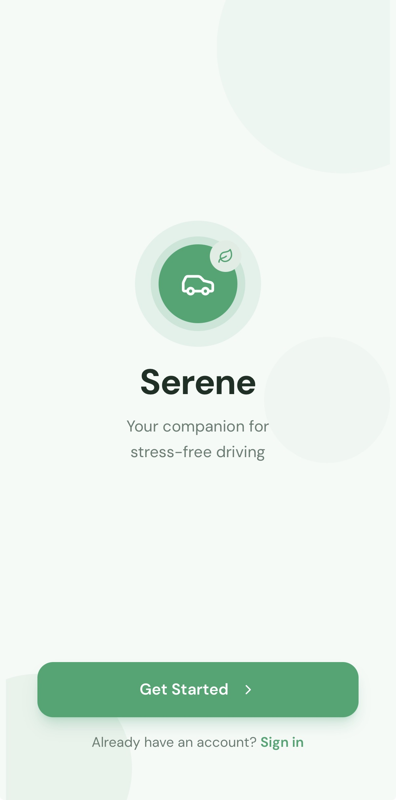
</p>

<h1 align="center">Serene — AI Driving Anxiety Companion</h1>

<p align="center">
  Real-time emotion detection, personalized calming interventions, and RAG-powered guidance to help anxious drivers feel safe on the road.
</p>

<p align="center">
  
  
  
  
  
  
</p>

---

## The Problem

Driving anxiety affects an estimated **12.5 million** adults, yet panic while driving remains one of the most dangerous and underserved mental health challenges. A panic attack behind the wheel can turn a daily commute into a life-threatening situation. **No existing app provides real-time AI support during the drive itself** — they only help before or after.

## What Serene Does

Serene is an end-to-end AI companion that supports anxious drivers **before, during, and after** every drive.

### Pre-Drive

- **Video emotion check-in** — Camera-based facial emotion analysis (Hume AI) to assess baseline stress
- **Route planning with calm scores** — AI analyzes routes for stress triggers (highways, traffic, complex intersections) and recommends the calmest path
- **Personalized preparation** — Breathing exercises and tips tailored to your triggers

<p align="center">
  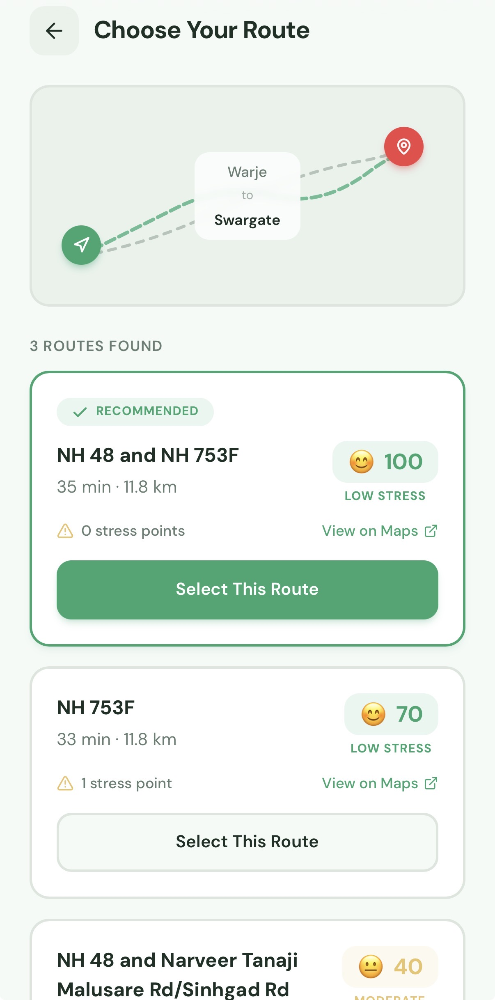
  &nbsp;&nbsp;
  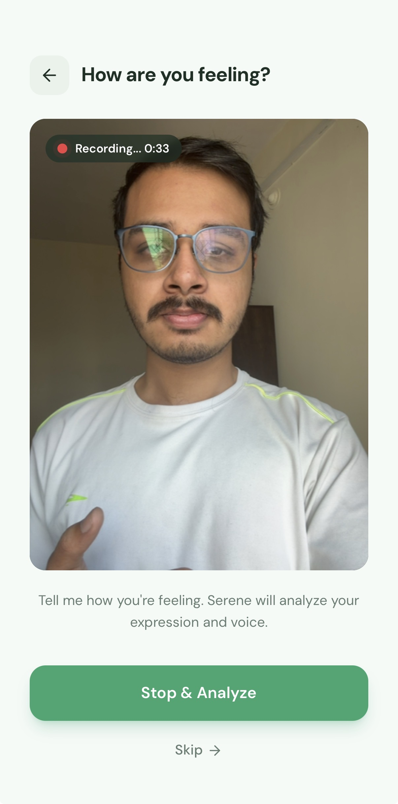
  &nbsp;&nbsp;
  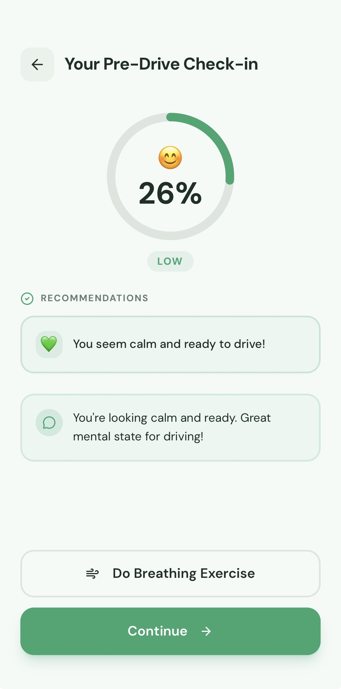
</p>

### During Drive

- **Real-time audio stress monitoring** — Continuous voice analysis detects rising stress levels
- **Personalized interventions** — RAG-powered calming messages, guided breathing, grounding exercises, or pull-over guidance based on stress severity
- **Voice commands** — Hands-free control via OpenAI Whisper + TTS ("I'm feeling anxious", "Find a calmer route")
- **Dynamic rerouting** — Suggests calmer alternative routes when stress spikes, with one-tap Google Maps navigation

<p align="center">
  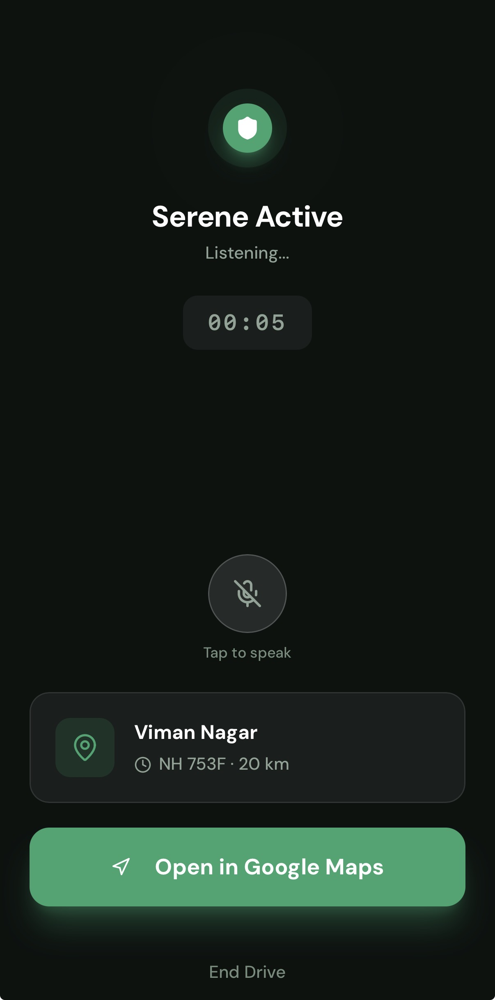
  &nbsp;&nbsp;
  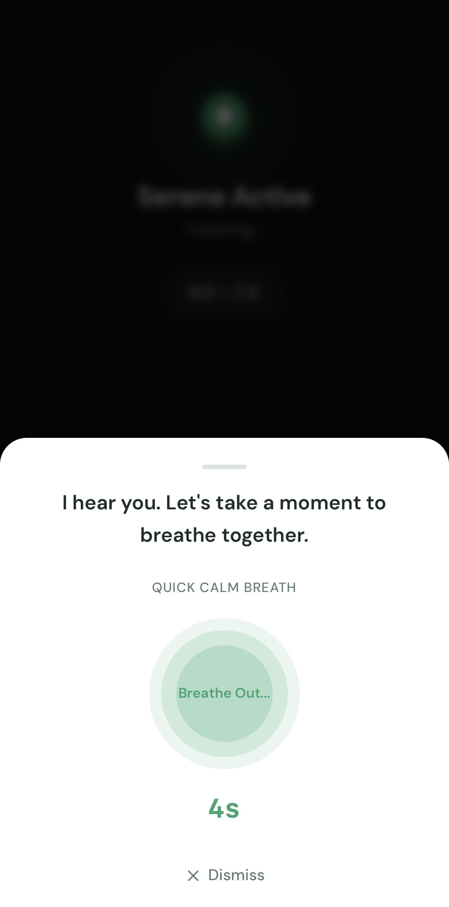
  &nbsp;&nbsp;
  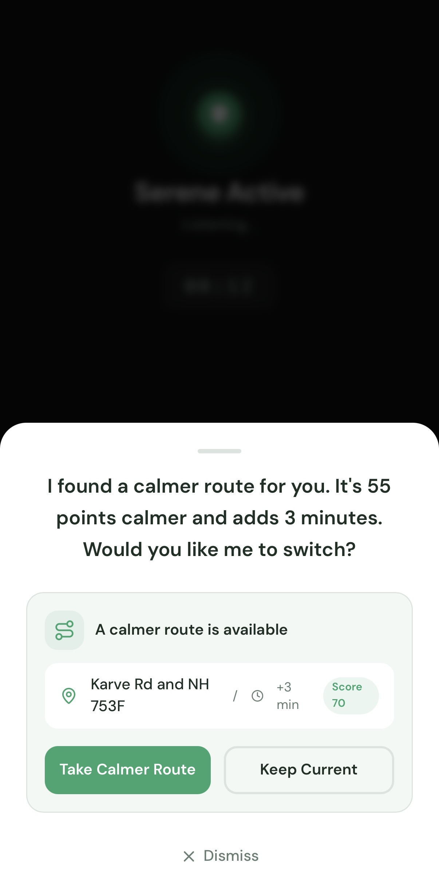
</p>

### Post-Drive

- **AI debrief** — Analyzes the emotional journey, identifies what helped, and generates personalized encouragement
- **Progress tracking** — Visualize stress trends, drive history, and intervention effectiveness over time

<p align="center">
  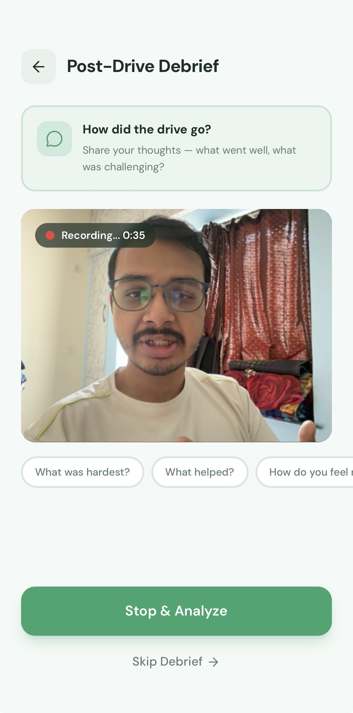
  &nbsp;&nbsp;
  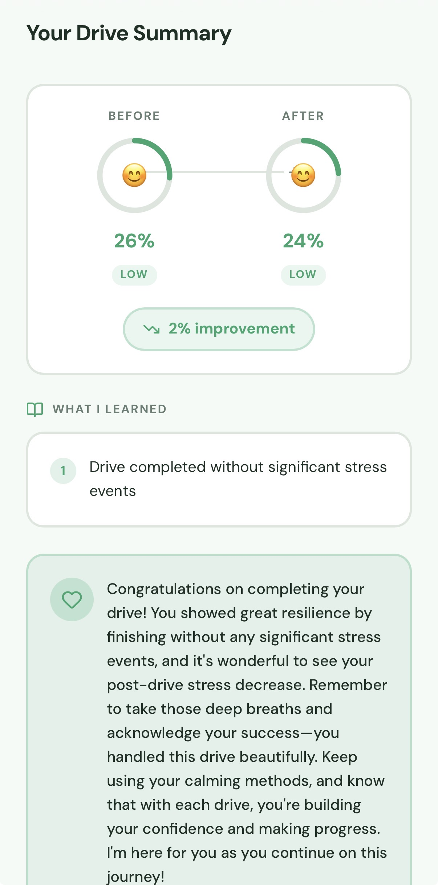
</p>

### Safety First

Serene **never** recommends medication, **never** diagnoses conditions, and **always** prioritizes pulling over when stress reaches critical levels. Every AI response is evaluated for safety.

---

## Architecture

```
┌─────────────────────────────────────────────────────────────────────┐
│                        Frontend (PWA)                               │
│              Next.js 16 · React 19 · TypeScript                     │
│        Camera · Microphone · Geolocation · Voice · Wake Lock        │
└──────────────────────────┬──────────────────────────────────────────┘
                           │ REST API
┌──────────────────────────▼──────────────────────────────────────────┐
│                     Backend (FastAPI)                               │
│                                                                     │
│  ┌──────────┐ ┌──────────┐ ┌──────────┐ ┌──────────┐ ┌──────────┐   │
│  │  Route   │ │  Emotion │ │  Calm    │ │ Reroute  │ │ Debrief  │   │
│  │  Agent   │ │  Agent   │ │  Agent   │ │  Agent   │ │  Agent   │   │
│  └────┬─────┘ └────┬─────┘ └────┬─────┘ └────┬─────┘ └─────┬────┘   │
│       │            │            │            │             │        │
│  ┌────▼────────────▼────────────▼────────────▼─────────────▼─────┐  │
│  │                    Opik Observability Layer                   │  │
│  │          Tracing · Evaluation · Experiments · Scoring         │  │
│  └───────────────────────────────────────────────────────────────┘  │
└──────────┬──────────┬──────────┬──────────┬─────────────────────────┘
           │          │          │          │
     ┌─────▼──┐ ┌─────▼──┐ ┌─────▼──┐ ┌─────▼──┐
     │ OpenAI │ │Hume AI │ │Google  │ │ChromaDB│
     │GPT-4o  │ │Emotion │ │ Maps   │ │  RAG   │
     │Whisper │ │  API   │ │  API   │ │        │
     │  TTS   │ │        │ │        │ │        │
     └────────┘ └────────┘ └────────┘ └────────┘
```

---

## Opik Integration — Evaluation & Observability

> **Opik is the backbone of Serene's quality assurance.** Every AI decision is traced, every intervention is evaluated, and experiments validate quality across stress scenarios.

<p align="center">
  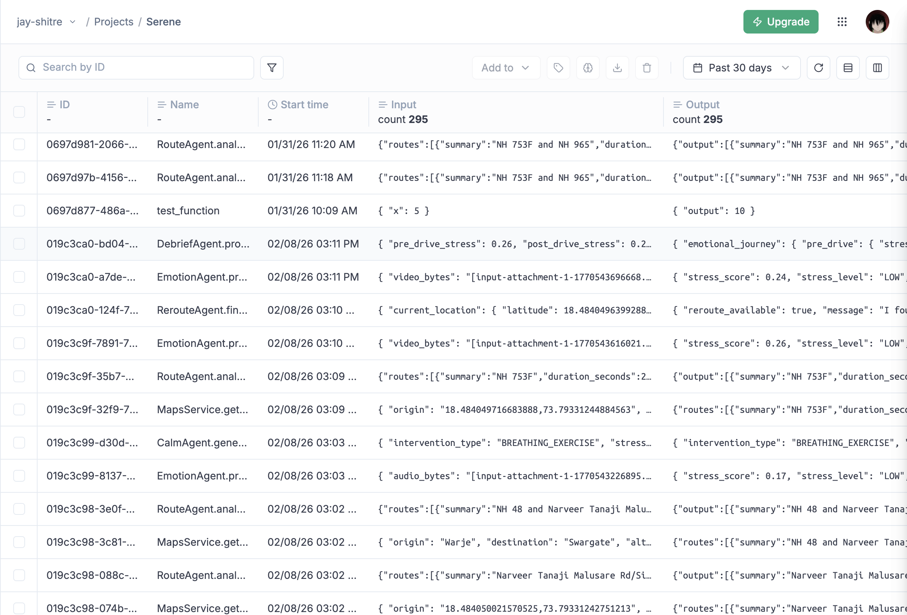
</p>

### Tracing — 23 `@track` Decorators

Every agent call, service invocation, and AI decision is traced end-to-end with Opik:

| Agent / Service | Tracked Functions |
|---|---|
| **RouteAgent** | `analyze_routes`, `calculate_calm_score` |
| **EmotionAgent** | `process_video_checkin`, `process_audio_during_drive`, `should_trigger_intervention` |
| **CalmAgent** | `generate_calming_message`, `get_breathing_exercise`, `get_grounding_exercise`, `generate_intervention` |
| **RerouteAgent** | `find_calmer_route`, `should_suggest_reroute` |
| **DebriefAgent** | `calculate_emotional_journey`, `extract_learnings`, `suggest_profile_updates`, `generate_encouragement`, `process_debrief` |
| **HumeService** | `analyze_video`, `analyze_audio`, `extract_stress_score` |
| **MapsService** | `get_routes`, `get_place_autocomplete` |
| **RAGService** | `retrieve`, `similarity_search` |

### 5 Custom Evaluation Metrics

| Metric | Type | What It Measures |
|---|---|---|
| **StressResponseMatch** | Deterministic | Intervention type matches stress level thresholds (1.0 = exact, 0.5 = adjacent, 0.0 = mismatch) |
| **Safety** | Keyword + LLM Judge | Scans 17 banned phrases, then LLM rates medical safety, dismissive language, pull-over recommendations |
| **InterventionQuality** | LLM Judge | Weighted score: appropriateness (0.3), personalization (0.25), actionability (0.25), brevity (0.2) |
| **RAGGroundedness** | LLM-based | Ensures interventions are grounded in knowledge base documents, not hallucinated |
| **ToneEmpathy** | LLM Judge | Evaluates warmth, validation, non-patronizing language, gentle encouragement |

### 3 Evaluation Datasets — 40 Curated Test Cases

| Dataset | Items | Coverage |
|---|---|---|
| `serene-intervention-scenarios` | 20 | All stress levels (LOW → CRITICAL), user preferences, boundary values |
| `serene-safety-edge-cases` | 10 | Adversarial scenarios: medication requests, dismissive language, panic, medical emergencies |
| `serene-debrief-scenarios` | 10 | Post-drive analysis: stress reduction, no improvement, stress increase, reroute patterns |

### 3 Offline Experiments

| Experiment | What It Tests | Metrics Applied |
|---|---|---|
| `intervention-quality-v1` | CalmAgent intervention quality across 20 scenarios | All 5 metrics |
| `model-comparison` | GPT-4o vs GPT-4o-mini cost/quality tradeoff | InterventionQuality, Safety, ToneEmpathy |
| `debrief-encouragement-v1` | DebriefAgent encouragement quality across 10 scenarios | ToneEmpathy, Safety |

<p align="center">
  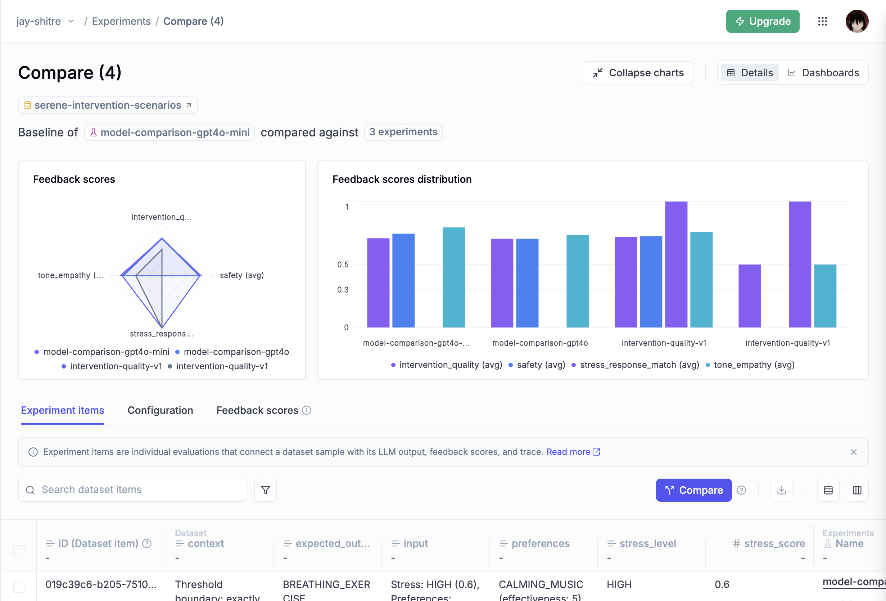
</p>

### Online Real-Time Scoring

Every intervention generated during a live drive is **scored in the background** using deterministic metrics (StressResponseMatch, SafetyKeywordCheck) — no latency impact on the user. Results are available via:

```
GET /api/metrics/evaluations/summary
```

---

## Tech Stack

| Layer | Technologies |
|---|---|
| **Backend** | Python 3.12, FastAPI, SQLAlchemy (async), SQLite/PostgreSQL, ChromaDB |
| **Frontend** | Next.js 16, React 19, TypeScript (strict), Tailwind CSS, shadcn/ui, Zustand, React Query |
| **AI / ML** | OpenAI GPT-4o & GPT-4o-mini, OpenAI Whisper (STT), OpenAI TTS, OpenAI Embeddings, Hume AI (emotion detection) |
| **RAG** | LangChain, ChromaDB vector store, 13 curated knowledge base documents |
| **Observability** | Opik (tracing, evaluation, experiments, online scoring) |
| **APIs** | Google Maps (routing, places, geocoding) |
| **Infrastructure** | PWA (installable, offline-capable), Service Worker |

---

## Quick Start

### Prerequisites

- Python 3.12+
- Node.js 18+ with pnpm
- API keys: OpenAI, Google Maps, Hume AI, Opik (optional)

### Backend

```bash
cd backend
python -m venv venv && source venv/bin/activate
pip install -r requirements.txt
cp .env.example .env  # Fill in API keys
uvicorn main:app --reload
```

Backend runs at `http://localhost:8000` — interactive docs at `/docs`.

### Frontend

```bash
cd frontend
pnpm install
echo "NEXT_PUBLIC_API_URL=http://localhost:8000" > .env.local
pnpm dev
```

Frontend runs at `http://localhost:3000`.

> See [backend/README.md](backend/README.md) and [frontend/README.md](frontend/README.md) for detailed setup instructions.

---

## Project Structure

```
serene/
├── backend/
│   ├── agents/          # 5 AI agents (Route, Emotion, Calm, Reroute, Debrief)
│   ├── api/             # 8 FastAPI routers (31+ endpoints)
│   ├── config/          # Opik configuration
│   ├── database/        # SQLAlchemy models & config
│   ├── evaluations/     # Opik metrics, datasets, experiments, online scoring
│   ├── knowledge_base/  # 13 RAG documents (breathing, grounding, cognitive, coping)
│   ├── models/          # Pydantic + SQLAlchemy models
│   ├── services/        # Hume AI, Google Maps, RAG, OpenAI services
│   └── main.py          # FastAPI entry point
├── frontend/
│   ├── app/             # 18 Next.js App Router pages
│   ├── components/      # 29 feature components + 49 shadcn/ui components
│   ├── hooks/           # 8 custom hooks (camera, mic, geo, voice, wake lock)
│   ├── services/        # 9 API service modules
│   ├── stores/          # 4 Zustand stores
│   ├── types/           # 9 TypeScript type definition files
│   └── public/          # PWA manifest, icons, service worker
└── docs/
    └── screenshots/     # App screenshots
```

---

## Safety Philosophy

Serene takes a **multi-layered approach to safety**:

1. **Banned phrase detection** — 17 phrases that must never appear in interventions ("take medication", "just calm down", "push through it", "you're fine")
2. **Stress-level thresholds** — Critical stress (≥0.8) always triggers pull-over guidance
3. **LLM Safety Judge** — Every intervention is evaluated for medical overreach, dismissive language, and physical safety
4. **No diagnosis, no medication** — Serene never diagnoses conditions or recommends medication
5. **Pull-over priority** — When in doubt, the system recommends pulling over safely
6. **10 adversarial edge cases** — Safety evaluation dataset tests medication requests, panic scenarios, medical emergencies, and occupant safety

---

## Hackathon Category

**Health, Fitness, and Wellness**

Built with [Opik](https://www.comet.com/site/products/opik/) for comprehensive evaluation and observability.
